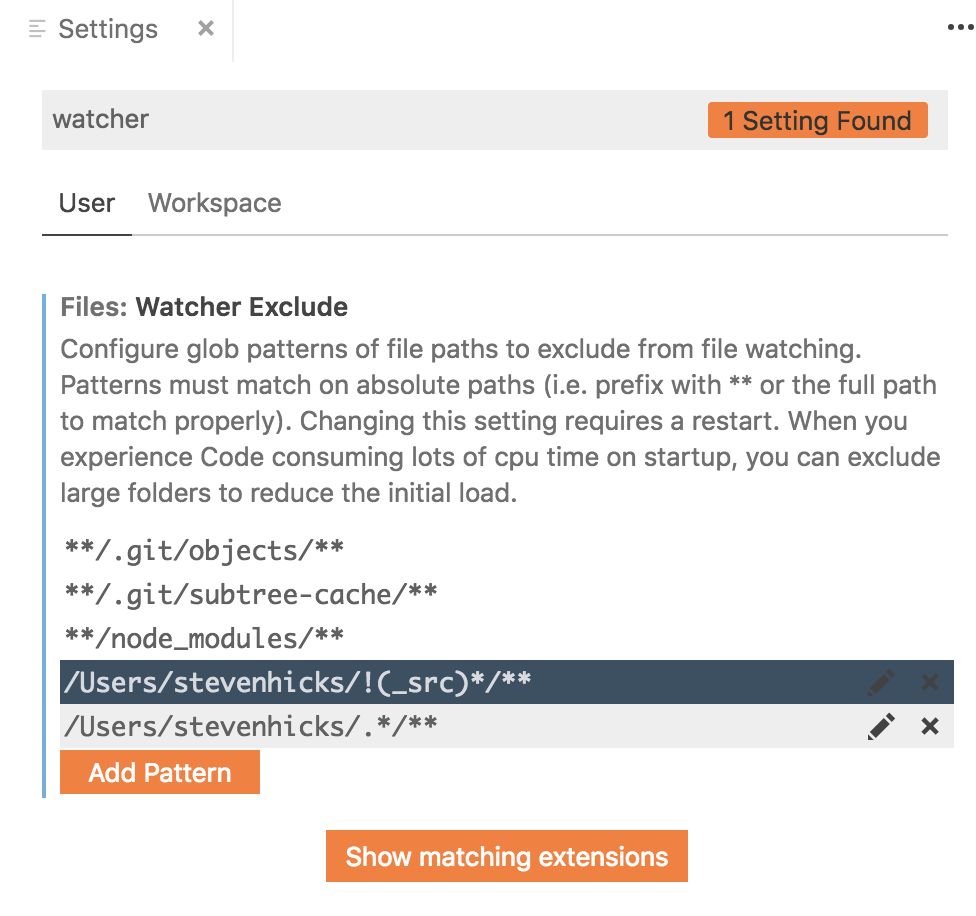
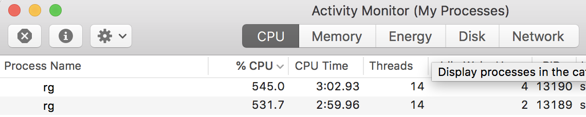

## TL;DR

There is a setting in VS Code named `files.watcherExclude`. If you're experiencing high CPU issues from VS Code, it _might_ be because you have a very large folder open, and VS Code is having trouble watching everything in it.

If this is the case, you can add a pattern to the `files.watcherExclude` setting to disable watching for specific patterns.






```
/Users/stevenhicks/!(_src)*/**
/Users/stevenhicks/.*/**
```

links

original issue:

https://github.com/Microsoft/vscode/issues/51757

https://github.com/Microsoft/vscode/wiki/Performance-Issues#visual-studio-code-is-consuming-a-lot-of-cpu

https://github.com/microsoft/vscode/issues/3998

globs:

https://unix.stackexchange.com/questions/164025/exclude-one-pattern-from-glob-match
